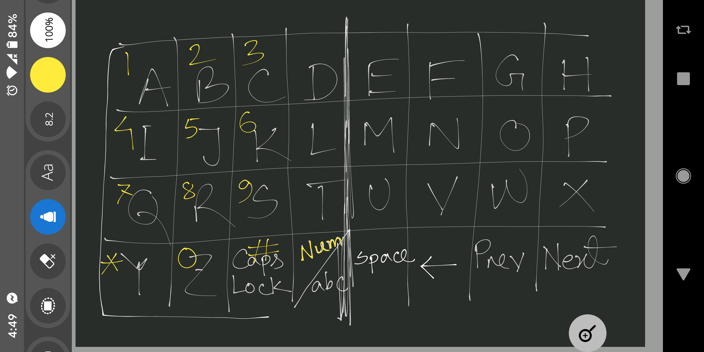

### LM35 - Temperature sensor
[Pin Out](https://www.electronicwings.com/sensors-modules/lm35-temperature-sensor)

### 4x4 Keypad Module
[Pin & Circuit](https://components101.com/misc/4x4-keypad-module-pinout-configuration-features-datasheet)

### Pulse sensor
[Pin Out](https://components101.com/sensors/pulse-sensor)

[Product Page](https://www.sparkfun.com/products/11574)

[Starting Code](https://github.com/WorldFamousElectronics/PulseSensorStarterProject)

### LCD without I2c 
Total 6 pin

[Interfacing with atmega32](https://electrosome.com/interfacing-lcd-atmega32-microcontroller-atmel-studio/)

### HC-05 FC-114 Bluetooth Module
[Module Pinout](https://www.electronicwings.com/sensors-modules/bluetooth-module-hc-05-)

[Interfacting with Atmega16/32](https://www.electronicwings.com/avr-atmega/hc-05-bluetooth-module-interfacing-with-atmega1632)

[Our device HC-05 FC-114](https://forum.arduino.cc/t/bluetooth-module-hc-05-with-a-button-and-en-pin-help/321715)

Note: Connect En with Vcc\
red led blinks every second means it is searching for connection\
red led blinks vary fast means it is in at mode\
state goes high when a device is connected

## Connection
1 ~ 8 - B0 ~ B7 = Keypad8 Columns \
9 - Reset\
10 - VCC\
11 - GND\
14 - RXD = Bluetooth module\
15 - TXD = Bluetooth module\
16 ~ 21 = LCD4bit \
22 - SCL\
23 - SDA\
30 - AVCC = VCC\
31 - GND\
32 - AREF = 1 micro F with GND\
33 ~ 36 - A4 ~ A7 = Keypad8 Rows\
39 - ADC1 = palse sensor analog input\
40 - ADC0 = temp sensor analog input\
