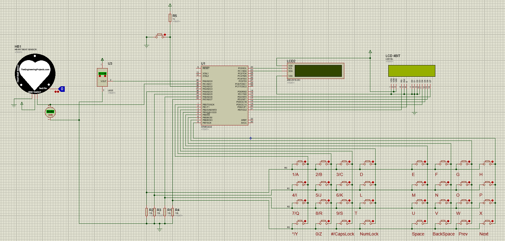
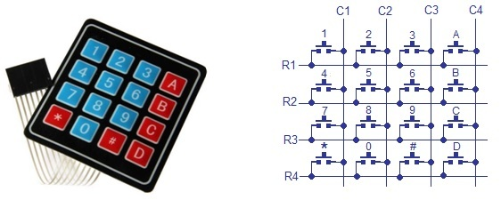
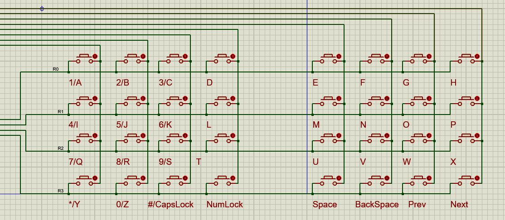
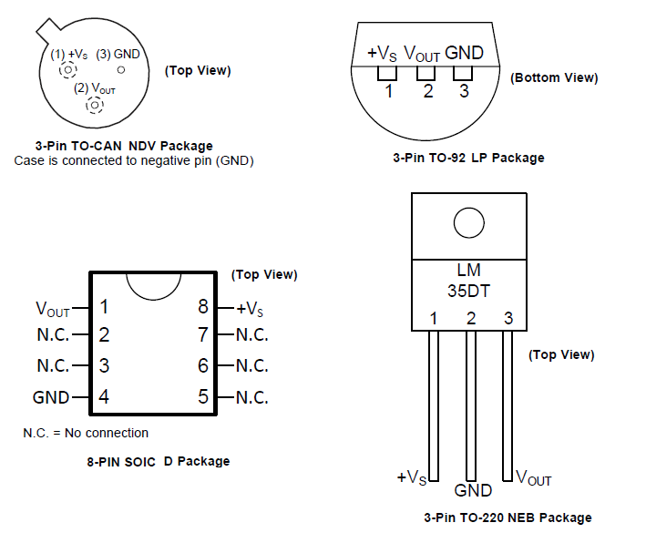
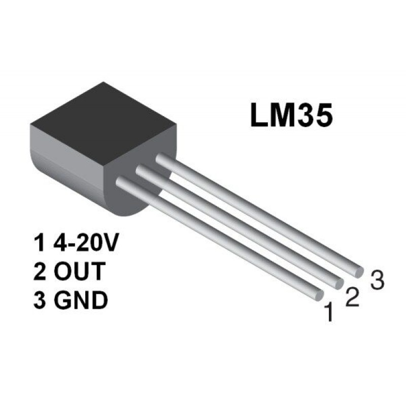
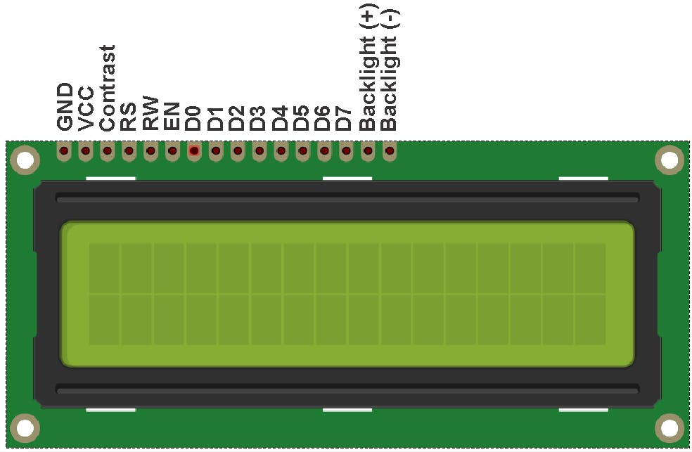

 [fig:buet~l~ogo]

### Bangladesh University of Engineering and Technology
### CSE 316 Report

* * * * *

**Doctor’s Private Chamber Entry Management**

* * * * *

***Submitted By***
* Mahdi Hasnat Siyam (*1705003*)
* Khandokar Md. Rahat Hossain (*1705024*)
* Kawshik Kumar Paul (*1705043*)

***Project Supervisor***\
Dr. A. B. M. Alim Al Islam\
Professor, Department of Computer Science and Engineering,\
Bangladesh University of Engineering and Technology (BUET)

Introduction
============

Maximum doctors have their own private chamber for the patients’
treatments. A private chamber is generally a tiny or small place with
one or two rooms. A doctor usually keeps himself/herself is a room and
the patients’ come inside the room one by one maintaining their serial.
Usually an assistant outside doctors’ room manage all of these things.

Sometimes it’s not so easy to maintain the serial. Even after entering
inside the doctors’ room, the doctor measures the body temperature,
pulse rate etc of the patient as these are the basic measure of a
patient’s health condition. It is very time consuming as temperature,
pulse rate measuring needs nearly more than one minute each.

In this project we have made a model by which the patient will put their
details through a keypad and then the body temperature and pulse rate
will be measured using some sensors and then stored. Doctor will call
the patients inside the room maintaining their serial by pressing a
button. In an LCD monitor, doctor will be able to see the current
patient details.

Project Description
===================

In a private chamber, there will be two parts. One is *Patients’ Corner*
and the other is *Doctors’ Corner*.

Patients’ Corner
----------------

This is a waiting room where patients’ come and wait for the doctors’
call for checkup. In this room there will be a booth. In that booth,
there is a keypad with lcd monitor, temperature sensor and pulse sensor.
Patient will come to this booth and provide their name, age, mobile
number through this keypad and by the help of that sensors, they will
provide their body temperature and pulse rate. After successfully done
with all these, patient will receive a serial number.

Doctors’ Corner
---------------

On doctors’ table there will be a lcd monitor and a button. The patients
who have registered, will be in a queue. If the doctor press the button,
the patient who is in the front of the queue will be called and the
information of the patient will be shown in the lcd monitor. After
checking up the patient, the next button press will call the next
patient and queue will be popped.

Circuit Diagram
===============

Components
==========

1.    **ATMega32**\
        A low power CMOS 8-bit microcontroller based on AVR enhanced
        RISC architecture.

2.   **4x4 Matrix Membrane Keypad**\
        A 16 button matrix keypad with a maximum rating of 24 VDC, 30 mA
        and bounce times $\leq$ 5 ms.

        

        

        To determine which button is pressed on the keypad, it first
        pulls each of the four columns either low or high one at a time.
        Then it polls the states of the four rows and depending on the
        column states, it can tell which button was active.\
        We used the 4x4 keypad for taking some primary information of a
        patient.

3.   **Sensors**

       **Temperature Sensor (LM35A)**\
        

        

        We essentially used LM35A to receive the body temperature of
        a patient as a pre-registration requirement.

        **Heart Rate Sensor (XD-58C)**\
        A pulse sensor for measuring heart rates. Its outcome can be
        measured by sensing heart beat pulses with a certain
        sampling rate and taking regression of the points about a
        certain threshold.

        
        [fig:my~l~abel]

        We used XD-58C to receive the regular bpm of a patient prior
        to registration.

4.   **16x2 Character LCD Display (LM016L)**\
        We used LM016L to display the input entries and processings in
        the Patients’ corner.

         [fig:my~l~abel]

     **16x2 I2C Interface LCD Display (JHD-2X16-I2C)**
        We used JHD-2X16-I2C to display the detailed information of the
        current patient in Doctor’s chamber.

Troubleshooting technique we used
=================================

-   **Connection with HC-05 with UART 9600 baud rate**\
    Initially we were working with hc-05 blue-tooth module. In data mode
    default settings has UART 9600 baud rate connection. But, frequency
    of our atmega32 was 1Mhz initially. So normal UART connection for
    9600 baud rate with 1mhz atmgea32 leads to 7.5% baud rate error. So
    to reduce error rate, we used double speed UART connection having
    error rate 0.16%.

-   **Connection with HC-05 with UART 38400 baud rate**\
    At the end our project HC-05 started malfunctioning. So we decided
    to reset hc-05. From data-sheet we found that we need to connect
    hc-05 with attention mode.

    In attention mode hc-05 works with UART 38400 baud rate. So if we
    setup 1mhz atmega32 normal UART connection for baud rate 38400, it
    will lead us 22.9% error. If we try with double speed UART
    connection we can obtain minimum 18,6% error rate. So we cannot work
    with 38400 UART connection with 1mhz atmega32. So only option we
    had, was to work with atmega32 with frequency.

    Due to lockdown we could not buy new crystal oscillator. But from
    atmega32 data-sheet, we found out that we can drive atmega32 at 8
    mhz frequency from its internal oscillator. So we changed clock
    frequency of atmega32 to 8mhz by altering fuse bit (CKSEL) through
    extreme burner and usb-asp.

-   **Factory reset setting for HC-05**\
    After connection with hc-05 in attention mode from 8mhz atmega32, we
    sent different AT command. Specially we tried resetting by
    sending$``AT+ORGL\backslash r\backslash n"$. After sending AT
    command, we got successful reply from hc-05 module. Still we could
    make connection with our mobile device with hc-05. We concluded that
    hc-05 might broken. So we wanted to buy new hc-05. But there was
    strict lockdown and we did not have enough time to wait for online
    delivery. So we decided to go on without hc-05 module.

Useful Links
============

-   **GitHub Repository:**\
    https://github.com/kawshikbuet17/Doctor-Private-Chamber-Entry-Management

-   **YouTube Demo:**\
    https://www.youtube.com/watch?v=6ee5QwgHWOg

Conclusion
==========

This project proposes a low cost way to manage a doctor’s private
chamber with some smart features. This is a very efficient way to manage
the patients’ serial and their checkup informations. If we were able to
integrate our bluetooth android app, we could make smarter management
system through wireless medium with some more features. Due to strict
Covid-19 lockdown, we couldn’t manage Arduino-UNO, so we couldn’t make
it wireless. We will try to make this project better in future. However,
it was a great experience working with microcontroller.
